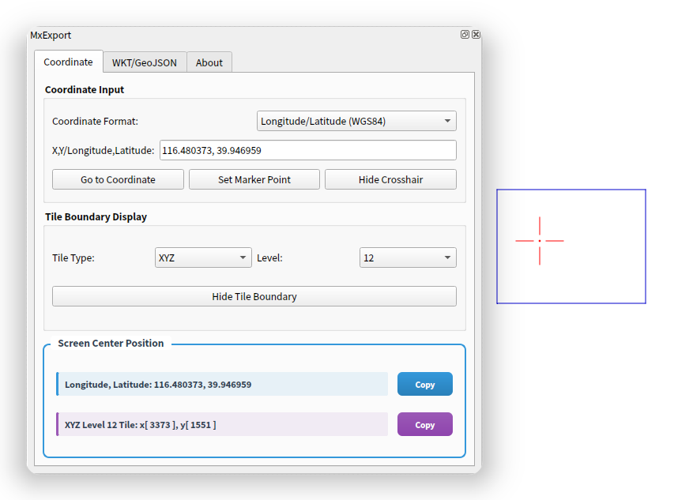
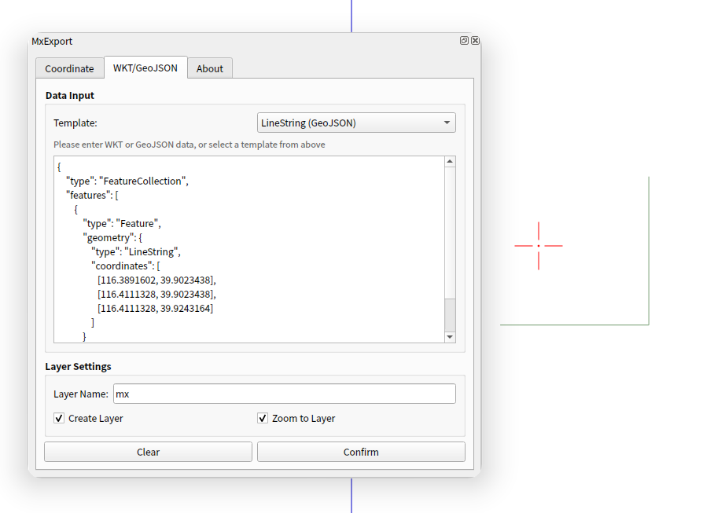

# MxExport QGIS 插件

一个功能强大的QGIS插件，用于坐标转换、瓦片边界显示和WKT/GeoJSON数据导入导出。

## 功能特性

### 🌍 坐标转换
- 支持多种坐标系统转换
- 经纬度与WGS84坐标系互转
- 实时坐标转换显示
- 一键跳转到指定坐标位置

### 🗺️ 瓦片边界显示
- 支持多种瓦片类型 (NDS等)
- 可调节缩放级别显示
- 屏幕中心位置信息显示
- 瓦片ID信息查看

### 📊 数据导入导出
- WKT (Well-Known Text) 格式支持
- GeoJSON 格式支持
- 批量数据处理
- 图层管理功能

## 更新日志

### v2.0
- ✨ 初始版本发布
- 🌍 坐标转换功能
- 🗺️ 瓦片边界显示
- 📊 WKT/GeoJSON数据支持

## 许可证

本项目采用 [Apache-2.0 license](LICENSE) - 详见LICENSE文件

